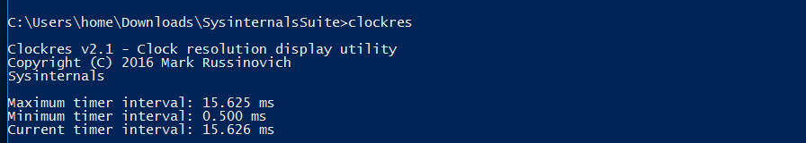
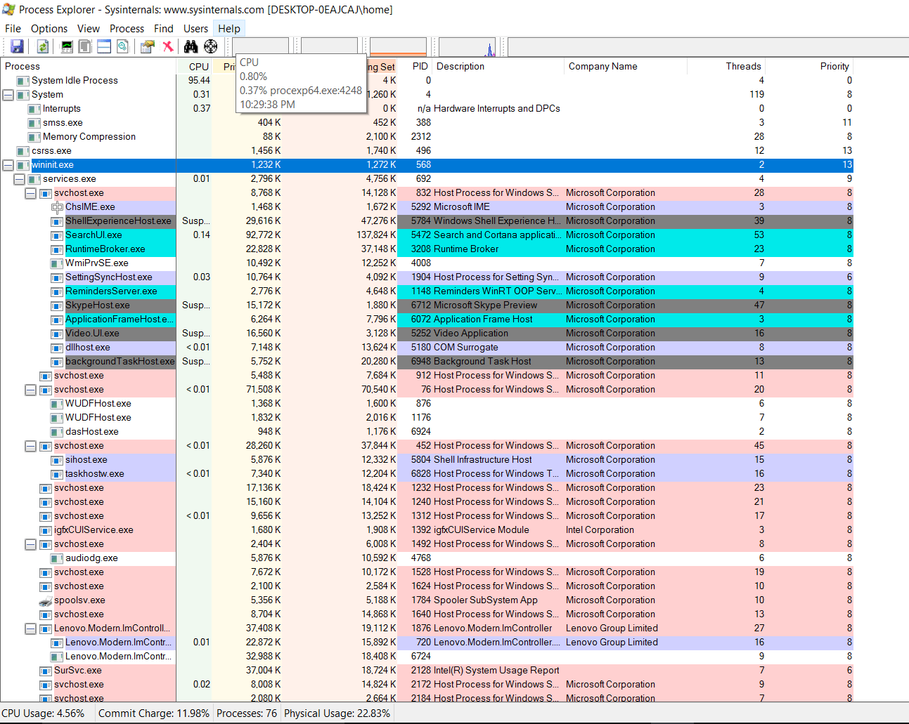
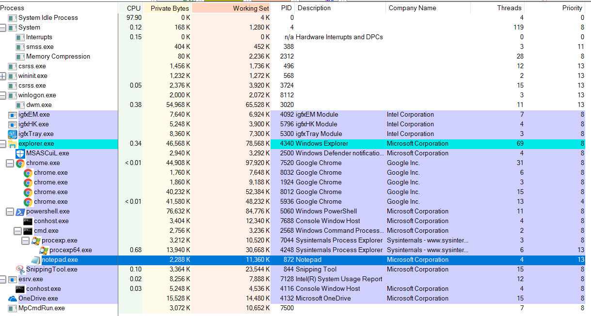
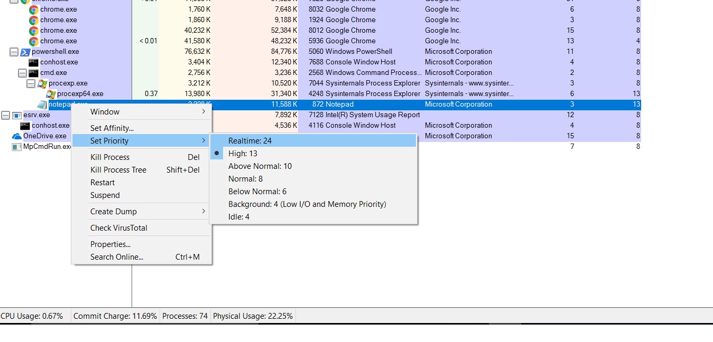
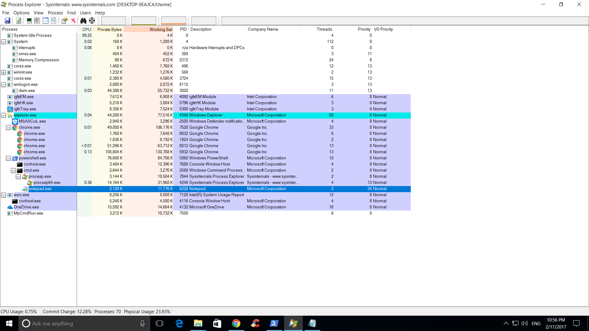
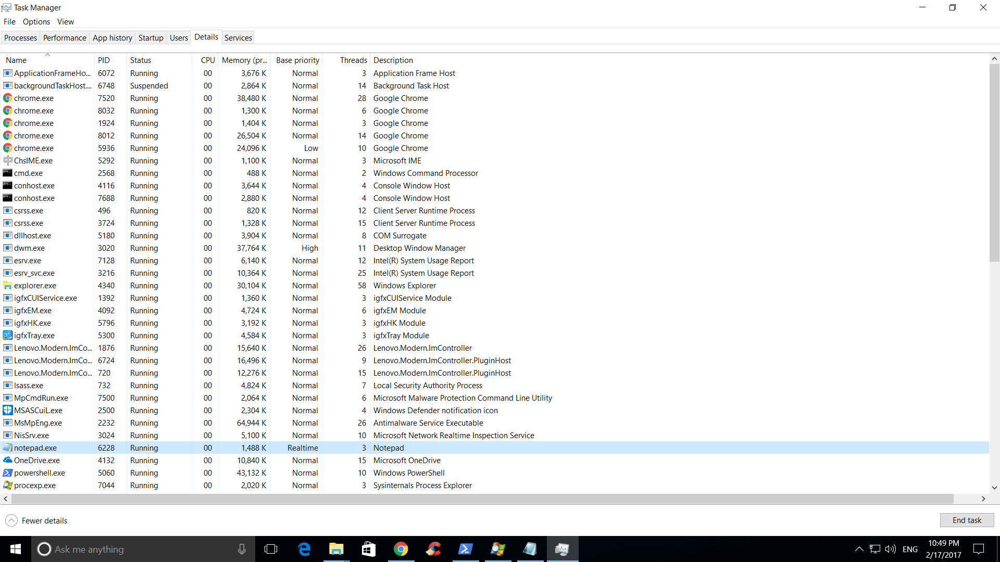

# Homework-3 Windows Sysinternals

* author: Yi Xie
* Class: CS453 [Operating Systems] Section 1

## Overview

In this homework, we are monitor processes under windows system and modify process priorities

## Manifest

README.md   ** README file for homework report **

## Steps

1. Install the Sysinternals Suite from Microsoft website.

2. Run the *colockres* program that came with Sysinternals suite from the Powersheel console

    The captured screenshoot 

3. Startup the process explorer *procexp* program in powershell from SysInternals Suite and add
   additional columns for number of threads and priority.

   The Captured screenshoot 

4. Start *notepad* in realtime mode. Find notepad in the process explorer, highlight it to show its
   priority

   The captured screenshoot  showed the
   priority is 13 which is not realtime mode. by right click the notepad process, user could set the
   priority to realtime mode, which is captured .
   The changed mode are shown in .

5. Check the priority of notepad with the following command in powershell.

   The captured screenshoot .

6. Start the task manager and add columns for threads and priority.

    The captured screenshoot 

## Sources used

[windows Sysinternals](https://technet.microsoft.com/en-us/sysinternals/bb842062.aspx)

